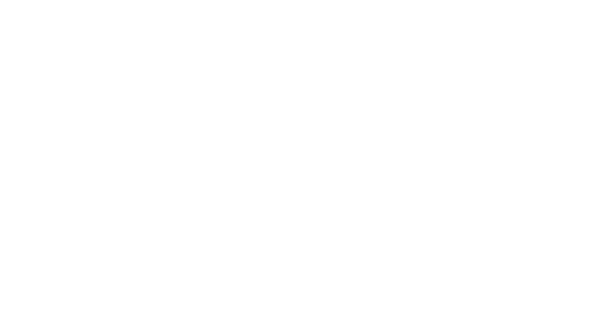

# Bienvenue dans la partie front-end du projet SegmentationUI

Ce projet a pour but de permettre à l'interface OHIF Viewer de lancer un algorithme de deep learning visant à détecter les méta-stases dans le cerveau, basé sur l'architecture UNETR. Cette partie du projet est l'interface utilisateur qui interagit avec l'API back-end pour récupérer les données médicales au format DICOM, lancer le modèle de deep learning, et visualiser les résultats.

## Attention

Ce projet est séparé en deux parties :
- La partie front-end (ce dépôt)
- La partie back-end est accessible [ici](https://github.com/VendenIX/BrainMetaSegmentatorUI-Back).

## Prérequis de Configuration pour lancer la partie front-end

| Ressource              | Requis                                                 |
|------------------------|--------------------------------------------------------|
| Node.js                | Version 14 ou supérieure                               |
| npm                    | Version 6 ou supérieure                                |

## Installation et Lancement

Pour lancer la partie front-end, il faut se placer dans le dossier front-end et lancer les commandes suivantes:
```
#Se placer dans le répertoire Viewers-3.7.0
npm i
npm start
```

Si vous avez des problèmes avec npm, vous pouvez faire **yarn install** au lieu de npm start.


## Démonstration

Vous pouvez voir une démonstration de l'utilisation de l'interface dans le GIF ci-dessous :


## Fonctionnalités

- **Ajout et suppression d'études** : Ajoutez et supprimez facilement des études DICOM via l'interface.
- **Suivi des patients** : Gérez et suivez les patients à travers différentes études et résultats de segmentation.
- **Segmentation des tumeurs** : Lancez la segmentation des méta-stases cérébrales via l'algorithme UNETR directement depuis l'interface.

## Configuration du Serveur Orthanc

Pour utiliser ce front-end, vous devez lancer le back-end du projet, il y a une pile docker contenant un serveur dicom werb Orthanc avec un proxy nginx, et une api flask, le setup complet est décrit dans le [README du back-end](https://github.com/VendenIX/BrainMetaSegmentatorUI-Back).

## Contact

Pour toute question ou assistance, vous pouvez créer une issue ou me contacter par mail.


