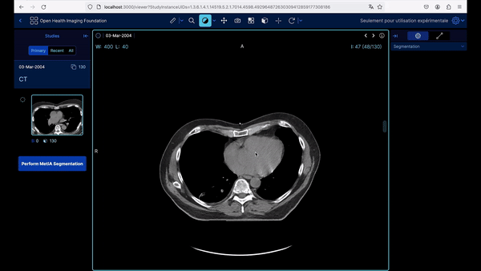
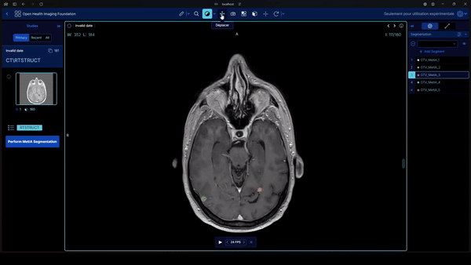

# Welcome to the SegmentationUI Front-end Project

This project aims to enable the OHIF Viewer interface to launch a deep learning algorithm designed to detect brain metastases, based on the UNETR architecture. This part of the project is the user interface that interacts with the back-end API to retrieve medical data in DICOM format, launch the deep learning model, and visualize the results.

In the framework of this project, a medical visualization interface capable of deploying the project's deep learning model was developed by students from the University of Caen for the cancer research institute, Centre François Baclesse. The project is based on the OHIF Viewer from the Massachusetts General Hospital (Harvard Medical School). An extension was developed for OHIF to enable the deployment of a deep learning model, with a patient tracking interface. The viewer allows for the generation of RTStruct or the modification of an existing RTStruct, all stored in a local DICOM WEB Server. Additionally, it is possible to connect the solution to a PACS. This functionality enables radiotherapists to easily utilize the artificial intelligence segmentation models developed in the CFB AI lab. Segmentation results are obtainable quickly with reasonably powerful configurations (segmentation in 30 seconds using an RTX 4080) and on any platform (Windows, MacOS, Ubuntu). The viewer also includes a patient tracking feature that allows monitoring the progression of metastases over time in a patient. Additional functionalities such as renaming or deleting regions of interest have been added, enabling an efficient workflow in clinical routine.

OHIF Viewer allows for creating segmentations, making measurements and exporting them, changing image contrast, viewing images from different angles, a video mode where you can choose the frame rate, and a DICOM tag browser.

## Important

This project is divided into two parts:
- The front-end part (this repository)
- The back-end part is accessible [here](https://github.com/VendenIX/BrainMetaSegmentatorUI-Back).

## Configuration Prerequisites to Run the Front-end

| Resource               | Requirement                                             |
|------------------------|----------------------------------------------------------|
| Node.js                | Version 14 or higher (recommended version: 18.0.0)       |
| npm or yarn            | Version 6 or higher                                      |

If you cannot install yarn, you can do everything with npm, but it is a bit more cumbersome.

## Installation and Launch

If you use Windows instead of Ubuntu or MACOS, use the windows branch :
```
git checkout deploiementWindows
```

To start the front-end part, navigate to the front-end directory and run the following commands:
```
# Navigate to the Viewers-3.7.0 directory
yarn install
yarn start
```

With npm:
```
# Navigate to the Viewers-3.7.0 directory
npm install --legacy-peer-deps
npm install ajv@latest ajv-keywords@latest --save-dev --legacy-peer-deps
npm install express --legacy-peer-deps
npm install cors --legacy-peer-deps
```

To build:
```
# Navigate to the Viewers-3.7.0 directory
npm run build
node server.js
```
This will place the build in the Viewer-3.7.0/platform/app/dist directory. This build will be used by the production server managed by the server.js file in the Viewer-3.7.0 directory. You just need to start the server with `node server.js` to launch the build, or `npm start` to launch in development mode.

## Demonstration

Quick demo here (without final patient follow-up): [YouTube Video](https://www.youtube.com/watch?v=PkEinJDBh0A)



Detailled video here: [Youtube Video](https://www.youtube.com/watch?v=WYHO6ywtnE4)


## Features of the MetIA Extension

- **Add and remove studies**: Easily add and remove DICOM studies via the interface.
- **Patient tracking**: Manage and track patients across different studies and segmentation results.
- **Deep learning segmentation of metastases**: Launch the segmentation of brain metastases via the UNETR algorithm directly from the interface.



## Orthanc Server Configuration

To use this front-end, you must run the back-end of the project. There is a Docker stack (optional, it can be bypassed) containing an Orthanc DICOM server with an nginx proxy and a Flask API. The complete setup is described in the [back-end README](https://github.com/VendenIX/BrainMetaSegmentatorUI-Back).
