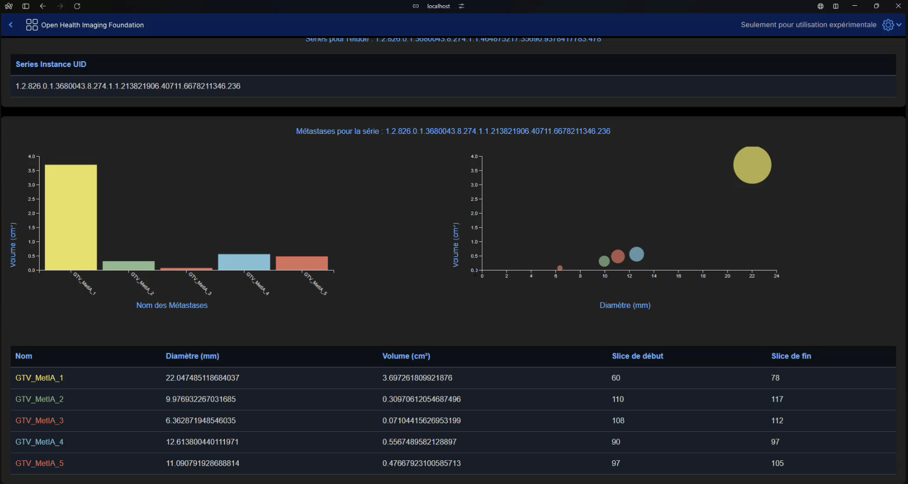

# Welcome to the SegmentationUI Front-end Project

This project aims to enable the OHIF Viewer interface to launch a deep learning algorithm designed to detect brain metastases, based on the UNETR architecture. This part of the project is the user interface that interacts with the back-end API to retrieve medical data in DICOM format, launch the deep learning model, and visualize the results.

In the framework of this project, a medical visualization interface capable of deploying the project's deep learning model was developed by students from the University of Caen for the cancer research institute, Centre François Baclesse. The project is based on the OHIF Viewer from the Massachusetts General Hospital (Harvard Medical School). An extension was developed for OHIF to enable the deployment of a deep learning model, with a patient tracking interface. The viewer allows for the generation of RTStruct or the modification of an existing RTStruct, all stored in a local DICOM WEB Server. Additionally, it is possible to connect the solution to a PACS. This functionality enables radiotherapists to easily utilize the artificial intelligence segmentation models developed in the CFB AI lab. Segmentation results are obtainable quickly with reasonably powerful configurations (segmentation in 30 seconds using an RTX 4080) and on any platform (Windows, MacOS, Ubuntu). The viewer also includes a patient tracking feature that allows monitoring the progression of metastases over time in a patient. Additional functionalities such as renaming or deleting regions of interest have been added, enabling an efficient workflow in clinical routine.

OHIF Viewer allows for creating segmentations, making measurements and exporting them, changing image contrast, viewing images from different angles, a video mode where you can choose the frame rate, and a DICOM tag browser.

## Important

This project is divided into two parts:
- The front-end part (this repository)
- The back-end part is accessible [here](https://github.com/VendenIX/BrainMetaSegmentatorUI-Back).

## Configuration Prerequisites to Run the Front-end

| Resource               | Requirement                                             |
|------------------------|----------------------------------------------------------|
| Node.js                | Version 14 or higher (recommended version: 18.0.0)       |
| npm or yarn            | Version 6 or higher                                      |

If you cannot install yarn, you can do everything with npm, but it is a bit more cumbersome.

## Installation and Launch

If you use Windows instead of Ubuntu or MACOS, use the windows branch :
```
git checkout deploiementWindows
```

To start the front-end part, navigate to the front-end directory and run the following commands:
```
# Navigate to the Viewers-3.7.0 directory
yarn install
yarn start
```

With npm:
```
# Navigate to the Viewers-3.7.0 directory
npm install --legacy-peer-deps
npm install ajv@latest ajv-keywords@latest --save-dev --legacy-peer-deps
npm install express --legacy-peer-deps
npm install cors --legacy-peer-deps
```

To build:
```
# Navigate to the Viewers-3.7.0 directory
npm run build
node server.js
```
This will place the build in the Viewer-3.7.0/platform/app/dist directory. This build will be used by the production server managed by the server.js file in the Viewer-3.7.0 directory. You just need to start the server with `node server.js` to launch the build, or `npm start` to launch in development mode.

## Demonstration

Quick demo here (without final patient follow-up): [YouTube Video](https://www.youtube.com/watch?v=PkEinJDBh0A)


Detailled video here: [Youtube Video](https://www.youtube.com/watch?v=WYHO6ywtnE4)


## Features of the MetIA Extension

- **Add and remove studies**: Easily add and remove DICOM studies via the interface.
- **Patient tracking**: Manage and track patients across different studies and segmentation results.
- **Deep learning segmentation of metastases**: Launch the segmentation of brain metastases via the UNETR algorithm directly from the interface.


An automated tracking patient follow-up page :



## Orthanc Server Configuration

To use this front-end, you must run the back-end of the project. There is a Docker stack (optional, it can be bypassed) containing an Orthanc DICOM server with an nginx proxy and a Flask API. The complete setup is described in the [back-end README](https://github.com/VendenIX/BrainMetaSegmentatorUI-Back).

## Citation

```bibtex
@article{DESSOUDE2025121002,
title = {Development and routine implementation of deep learning algorithm for automatic brain metastases segmentation on MRI for RANO-BM criteria follow-up},
journal = {NeuroImage},
volume = {306},
pages = {121002},
year = {2025},
issn = {1053-8119},
doi = {https://doi.org/10.1016/j.neuroimage.2025.121002},
url = {https://www.sciencedirect.com/science/article/pii/S1053811925000023},
author = {Loïse Dessoude and Raphaëlle Lemaire and Romain Andres and Thomas Leleu and Alexandre G. Leclercq and Alexis Desmonts and Typhaine Corroller and Amirath Fara Orou-Guidou and Luca Laduree and Loic Le Henaff and Joëlle Lacroix and Alexis Lechervy and Dinu Stefan and Aurélien Corroyer-Dulmont},
keywords = {Deep learning, Radiology, Brain metastases, RANO-BM, Clinical routine},
abstract = {Rationale and objectives
The RANO-BM criteria, which employ a one-dimensional measurement of the largest diameter, are imperfect due to the fact that the lesion volume is neither isotropic nor homogeneous. Furthermore, this approach is inherently time-consuming. Consequently, in clinical practice, monitoring patients in clinical trials in compliance with the RANO-BM criteria is rarely achieved. The objective of this study was to develop and validate an AI solution capable of delineating brain metastases (BM) on MRI to easily obtain, using an in-house solution, RANO-BM criteria as well as BM volume in a routine clinical setting.
Materials (patients) and methods
A total of 27,456 post-Gadolinium-T1 MRI from 132 patients with BM were employed in this study. A deep learning (DL) model was constructed using the PyTorch and PyTorch Lightning frameworks, and the UNETR transfer learning method was employed to segment BM from MRI.
Results
A visual analysis of the AI model results demonstrates confident delineation of the BM lesions. The model shows 100 % accuracy in predicting RANO-BM criteria in comparison to that of an expert medical doctor. There was a high degree of overlap between the AI and the doctor's segmentation, with a mean DICE score of 0.77. The diameter and volume of the BM lesions were found to be concordant between the AI and the reference segmentation. The user interface developed in this study can readily provide RANO-BM criteria following AI BM segmentation.
Conclusion
The in-house deep learning solution is accessible to everyone without expertise in AI and offers effective BM segmentation and substantial time savings.}
}
```
